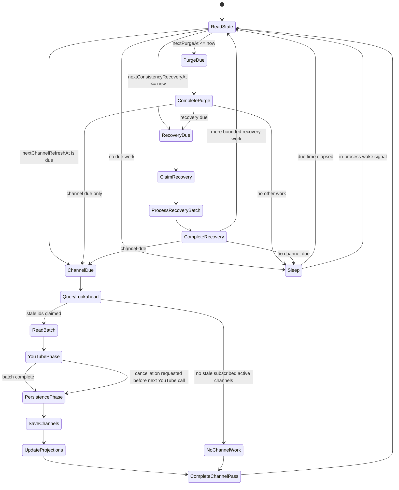

# Worker State Model

The application should use one provider-agnostic hosted worker. It replaces the current separate channel update and maintenance workers.

## Responsibilities

The worker handles:

- expiration purge phase
- stale channel refresh phase
- permanent failure status updates
- canonical channel saves
- list projection updates
- Cosmos consistency/lifecycle recovery
- worker state updates

For Cosmos DB, expiration purge is a no-op because TTL handles physical cleanup. For SQL Server, expiration purge deletes expired rows.

## Worker State

Worker state is provider-backed.

SQL Server uses a unit table:

```sql
CREATE TABLE WorkerState (
    Id INT NOT NULL CONSTRAINT PK_WorkerState PRIMARY KEY,
    NextChannelRefreshAt DATETIMEOFFSET NULL,
    ChannelRefreshForceCount BIGINT NOT NULL,
    NextPurgeAt DATETIMEOFFSET NOT NULL,
    NextConsistencyRecoveryAt DATETIMEOFFSET NOT NULL,
    ConsistencyRecoveryForceCount BIGINT NOT NULL,
    CONSTRAINT CK_WorkerState_Id CHECK (Id = 1)
);
```

Cosmos DB uses a singleton system document:

```json
{
  "id": "scheduler",
  "nextChannelRefreshAt": "2026-05-09T13:00:00Z",
  "channelRefreshForceCount": 0,
  "nextPurgeAt": "2026-05-09T13:10:00Z",
  "nextConsistencyRecoveryAt": "2026-05-09T12:01:00Z",
  "consistencyRecoveryForceCount": 3
}
```

State is get-or-create. On the first run:

- `NextChannelRefreshAt = clock.UtcNow`
- `NextPurgeAt = clock.UtcNow`
- `NextConsistencyRecoveryAt = clock.UtcNow`
- `ConsistencyRecoveryForceCount = 0`

## Channel Refresh State Semantics

`NextChannelRefreshAt` meanings:

- `null`: no known active subscribed channel work
- `DateTimeOffset.MinValue`: forced refresh/run as soon as possible
- `<= now`: due
- `> now`: sleep until that time

Request paths that add a new or stale channel should call:

```csharp
Task ForceChannelRefreshAsync(CancellationToken cancellationToken);
```

That method sets `NextChannelRefreshAt = DateTimeOffset.MinValue` and advances a force generation/counter.

The web process should also pulse an in-process wake signal so the worker wakes immediately if it is sleeping. The durable state handles restarts and missed signals.

## State Store Methods

The worker state store should expose purpose-specific methods:

```csharp
public interface IWorkerStateStore
{
    Task<WorkerState> GetOrCreateAsync(CancellationToken cancellationToken);
    Task ForceChannelRefreshAsync(CancellationToken cancellationToken);
    Task ForceConsistencyRecoveryAsync(CancellationToken cancellationToken);

    Task CompleteChannelRefreshPassAsync(
        DateTimeOffset? observedNextChannelRefreshAt,
        long observedChannelRefreshForceCount,
        DateTimeOffset? nextChannelRefreshAt,
        CancellationToken cancellationToken);

    Task CompletePurgeAsync(
        DateTimeOffset nextPurgeAt,
        CancellationToken cancellationToken);

    Task CompleteConsistencyRecoveryPassAsync(
        DateTimeOffset observedNextConsistencyRecoveryAt,
        long observedConsistencyRecoveryForceCount,
        DateTimeOffset nextConsistencyRecoveryAt,
        CancellationToken cancellationToken);
}
```

`CompleteChannelRefreshPassAsync` must not erase a forced refresh that happened while the worker was processing. It should only move channel refresh later if the stored value and force generation still match the state observed by the worker. The generation matters when the worker observed `DateTimeOffset.MinValue` and another force writes the same sentinel during the pass.

`CompletePurgeAsync` can simply set `NextPurgeAt`.

`ForceConsistencyRecoveryAsync` sets the next time to
`DateTimeOffset.MinValue`, increments `ConsistencyRecoveryForceCount`, and
pulses the in-process wake signal. Application startup invokes it so persisted
work is examined immediately.

`CompleteConsistencyRecoveryPassAsync` advances the polling hint only when both
observed recovery fields still match; a force during the pass makes completion a
successful no-op. Cosmos recovery correctness is carried by list/channel pending
flags and recovery documents, not by the singleton timestamp.

The worker calls the provider-neutral recovery port:

```csharp
public interface IConsistencyRecoveryService
{
    Task<ConsistencyRecoveryPassResult> RecoverAsync(
        ConsistencyRecoveryPassBudget budget,
        CancellationToken cancellationToken);
}
```

SQL returns an empty result. Cosmos reports counts, request charge,
`HasMoreEligibleWork`, and `NextEligibleAt`. The worker schedules immediately
when more work is eligible; otherwise it uses the earlier of the returned
deadline and the one-minute polling ceiling, then conditionally completes using
the state observed before the pass.

Every recovery business-document, claim, transactional-batch, checkpoint, and
global-cursor conditional write gets one reread/retry after its initial conflict.
A second conflict leaves durable work eligible for a later pass. An observed
worker-state generation mismatch is instead an intentional no-op; it must not be
retried as an overwrite of the newer force.

## Worker Loop



## Batching

Suggested defaults:

- `ChannelRefreshBatchSize = 10`
- `ChannelRefreshLookaheadMultiplier = 10`
- `ChannelRefreshLookaheadCount = 100`
- `YoutubeCallDelay = 2 seconds`
- `PurgeInterval = 10 minutes`
- `ConsistencyRecoveryPollInterval = 1 minute`
- `ConsistencyRecoveryBatchSize = 25`
- `ConsistencyRecoveryMaxItemsPerPass = 100`
- `ConsistencyRecoveryRuBudgetPerPass = 2000`
- `ConsistencyRecoveryLeaseDuration = 2 minutes`
- `LifecycleExpiryRecheckInterval = 10 minutes`
- `RecoveryMaxActiveEdgesPerList = 125`

The worker should query lightweight stale-channel lookahead records, select the first configured batch, then point-read full channel documents for that batch.

The consistency phase runs before YouTube work so reverse references and
lifecycle cleanup do not depend on stale refresh eligibility or spend YouTube
quota. It processes fixed pages and yields after its item/RU budget, allowing the
normal worker phases to run. If more recovery remains, it schedules another
immediate pass rather than draining an unbounded backlog in one loop.

Membership, Projection, EdgeDue, and LifecycleDue share that budget through a
durable round-robin page-ticket cursor. The worker advances the cursor before
each page. If the page exhausts RU or the process stops, the next pass/instance
starts with the persisted successor. Consequently each kind is offered within
four admitted tickets despite a continuously replenished earlier kind; EdgeDue's
own fixed-cycle keyset gives the same non-starvation property to due poison work.

Multiple application instances may enter the phase. They claim individual
recovery records with ETag-protected leases; pending list/channel version
completion is also conditional. Duplicate work is safe because each repair
rereads list membership authority. A stopped instance's work becomes visible
when its lease expires.

Lookahead shape:

- channel id
- stale timestamp

Batch shape:

- full canonical channel domain objects

## YouTube Call Flow

For each batch:

1. Read up to N full channel documents.
2. Bulk fetch channel metadata by channel id.
3. Apply metadata updates in memory, including URL and playlist id.
4. Fetch playlist items per channel, with delay between YouTube calls.
5. Bulk fetch video durations across all videos in the batch.
6. Build updated channel documents in memory.
7. Persist canonical channel updates.
8. Update affected list projections.
9. Complete worker state.

Metadata failure does not block video refresh if an existing playlist id is usable.

Known permanent failures mark a channel unavailable and stop future refreshes.

## Cancellation

Cancellation should stop new YouTube calls, but it should not abandon results already fetched from YouTube.

If cancellation is requested during the YouTube phase:

- do not start another YouTube call
- keep completed channel results
- move to persistence/finalization

During persistence/finalization:

- save completed channel results
- update affected projections
- complete worker state safely
- leave unprocessed channels stale so they are retried later

This avoids spending YouTube quota without persisting the result.

Canonical channel persistence sets a durable projection-pending version before
projection fan-out. Cancellation or process termination can therefore leave
projection work incomplete without losing it; the consistency phase resumes it
on restart, including for a channel that became fresh or unavailable.
