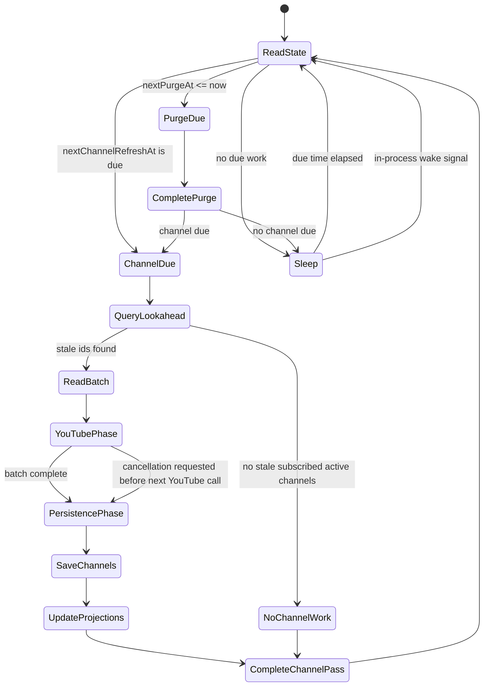

# Worker State Model

The application should use one provider-agnostic hosted worker. It replaces the current separate channel update and maintenance workers.

## Responsibilities

The worker handles:

- expiration purge phase
- stale channel refresh phase
- permanent failure status updates
- canonical channel saves
- list projection updates
- worker state updates

For Cosmos DB, expiration purge is a no-op because TTL handles physical cleanup. For SQL Server, expiration purge deletes expired rows.

## Worker State

Worker state is provider-backed.

SQL Server uses a unit table:

```sql
CREATE TABLE WorkerState (
    Id INT NOT NULL CONSTRAINT PK_WorkerState PRIMARY KEY,
    NextChannelRefreshAt DATETIMEOFFSET NULL,
    NextPurgeAt DATETIMEOFFSET NOT NULL,
    CONSTRAINT CK_WorkerState_Id CHECK (Id = 1)
);
```

Cosmos DB uses a singleton system document:

```json
{
  "id": "scheduler",
  "nextChannelRefreshAt": "2026-05-09T13:00:00Z",
  "nextPurgeAt": "2026-05-09T13:10:00Z"
}
```

State is get-or-create. On the first run:

- `NextChannelRefreshAt = clock.UtcNow`
- `NextPurgeAt = clock.UtcNow`

## Channel Refresh State Semantics

`NextChannelRefreshAt` meanings:

- `null`: no known active subscribed channel work
- `DateTimeOffset.MinValue`: forced refresh/run as soon as possible
- `<= now`: due
- `> now`: sleep until that time

Request paths that add a new or stale channel should call:

```csharp
Task ForceChannelRefreshAsync(CancellationToken cancellationToken);
```

That method sets `NextChannelRefreshAt = DateTimeOffset.MinValue`.

The web process should also pulse an in-process wake signal so the worker wakes immediately if it is sleeping. The durable state handles restarts and missed signals.

## State Store Methods

The worker state store should expose purpose-specific methods:

```csharp
public interface IWorkerStateStore
{
    Task<WorkerState> GetOrCreateAsync(CancellationToken cancellationToken);
    Task ForceChannelRefreshAsync(CancellationToken cancellationToken);

    Task CompleteChannelRefreshPassAsync(
        DateTimeOffset? observedNextChannelRefreshAt,
        DateTimeOffset? nextChannelRefreshAt,
        CancellationToken cancellationToken);

    Task CompletePurgeAsync(
        DateTimeOffset nextPurgeAt,
        CancellationToken cancellationToken);
}
```

`CompleteChannelRefreshPassAsync` must not erase a forced refresh that happened while the worker was processing. It should only move channel refresh later if the stored value still matches the value observed by the worker.

`CompletePurgeAsync` can simply set `NextPurgeAt`.

## Worker Loop



## Batching

Suggested defaults:

- `ChannelRefreshBatchSize = 10`
- `ChannelRefreshLookaheadMultiplier = 10`
- `ChannelRefreshLookaheadCount = 100`
- `YoutubeCallDelay = 5 seconds`
- `PurgeInterval = 10 minutes`

The worker should query lightweight stale-channel lookahead records, then point-read full channel documents for each batch.

Lookahead shape:

- channel id
- stale timestamp

Batch shape:

- full canonical channel domain objects

## YouTube Call Flow

For each batch:

1. Read up to N full channel documents.
2. Bulk fetch channel metadata by channel id.
3. Apply metadata updates in memory, including URL and playlist id.
4. Fetch playlist items per channel, with delay between YouTube calls.
5. Bulk fetch video durations across all videos in the batch.
6. Build updated channel documents in memory.
7. Persist canonical channel updates.
8. Update affected list projections.
9. Complete worker state.

Metadata failure does not block video refresh if an existing playlist id is usable.

Known permanent failures mark a channel unavailable and stop future refreshes.

## Cancellation

Cancellation should stop new YouTube calls, but it should not abandon results already fetched from YouTube.

If cancellation is requested during the YouTube phase:

- do not start another YouTube call
- keep completed channel results
- move to persistence/finalization

During persistence/finalization:

- save completed channel results
- update affected projections
- complete worker state safely
- leave unprocessed channels stale so they are retried later

This avoids spending YouTube quota without persisting the result.
