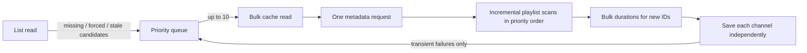

# Demand-Driven YouTube Sync Design

## Status

Implemented replacement for the previous FIFO channel refresh queue and full-window batch pipeline.

This design assumes the simplified persistence model described in
[`architecture.md`](architecture.md): lists contain channel IDs, each channel is an independently
writable cache, refresh work is requested by list access, the queue is best-effort and in-memory,
and production runs one application instance.

## Problem

The current pipeline retained batching choices that were valuable when one channel refresh could
fan out into many embedded list projections. That fan-out no longer exists. A refresh now updates
one channel document or one normalized set of SQL channel rows, but it still:

- processes a FIFO batch in channel-ID insertion order, with no promotion for missing channels,
  explicit refreshes, or older stale data;
- refuses a duplicate enqueue rather than upgrading its priority;
- fetches the complete 30-day upload window on every refresh;
- fetches durations again for every video returned in that window;
- waits two seconds before every playlist page and duration request, regardless of observed rate
  limiting;
- performs all playlist work before duration work and persists only after the batch YouTube phase;
- requeues the whole batch after an exception, including work that may already have succeeded; and
- silently completes queued IDs whose channel cache document is missing because the repository
  batch read returns only existing channels.

The result is low throughput and head-of-line blocking. A typical ten-channel batch with one
playlist page per channel cannot finish its playlist phase in less than about 20 seconds solely
because of the fixed delay. Channels with multiple pages and many cached videos add more delay and
duration calls before any channel is saved.

## Goals

- Refresh the channels that matter to a current user before less useful work.
- Maximize useful completed channels per unit of time without aggressively bursting the YouTube
  API.
- Keep quota usage close to one playlist request per ordinary channel refresh, plus amortized
  metadata and duration requests.
- Persist progress per channel so one slow or failed channel does not discard a cohort's work.
- Preserve the bounded, in-memory, single-instance model and storage-agnostic domain boundaries.
- Keep the HTTP list read non-blocking: it renders cached data and only requests background work.

## Non-Goals

- Durable scheduling, global stale-channel scans, leases, or multi-instance coordination.
- Embedded list projections or reverse channel-to-list references.
- Parallel refresh workers in the first implementation.
- Perfect immediate detection of a recently deleted or privatized cached video.
- A locally reconstructed copy of Google's quota accounting.

## Decisions

### 1. Queue typed refresh requests, not bare channel IDs

Use one bounded queue with one entry per channel and three priority classes:

1. `Missing`: a list references no usable channel cache, including a newly added channel with no
   videos yet.
2. `Forced`: the user explicitly requested a refresh.
3. `Stale`: a viewed list found an active channel whose `StaleAfter` is due.

Within a class, process the oldest `StaleAfter` first and use enqueue sequence as the stable
tie-breaker. Missing entries without a stale time use enqueue sequence.

Enqueuing an already-pending ID must upgrade its priority when the new request is more important;
it must not add another entry. An ordinary view while an ID is in flight is satisfied by that
flight. A force request arriving after the flight began records at most one follow-up run. Repeated
force requests coalesce.

The queue remains bounded by distinct channel IDs. If it is full, report the dropped request and
its class in metrics/logs. A later list access will request the work again. Do not add persistence,
leases, or recovery documents for this condition.

Suggested request shape:

```csharp
enum ChannelRefreshReason { Missing, Forced, Stale }

record ChannelRefreshRequest(
    string ChannelId,
    ChannelRefreshReason Reason,
    DateTimeOffset? StaleAfter);
```

The list service should submit all candidates as one collection so it can classify and order them
before waking the worker. It should not depend on list membership order, which is ordinal channel
ID order in Cosmos.

### 2. Use small cohorts only where batching saves calls

After the first request arrives, allow a very short coalescing window (initially 100 ms), then take
up to 10 requests in priority order. Ten is a latency bound, not a YouTube limit.

For each cohort:

1. Bulk-read the current channel caches.
2. Fetch channel metadata for all IDs with one `channels.list` call.
3. Reconcile playlist items for each channel in priority order.
4. Fetch durations for newly discovered video IDs in `videos.list` chunks of 50, sharing each
   chunk across channels where possible.
5. Merge and save each completed channel independently.
6. Complete successful or permanently unavailable IDs and requeue only transiently failed IDs.

Retain a cohort size of 10 initially because it bounds head-of-line delay while still amortizing
metadata and duration calls. The YouTube API permits up to 50 channel IDs in `channels.list`; the
cohort can be increased from measurements without changing the design.

Do not introduce concurrent playlist fetches initially. One consumer and one in-flight YouTube
request make ordering, rate control, shutdown, and failure behavior predictable. Bounded
concurrency can be considered later only if request latency, rather than pacing, is proven to be
the throughput constraint.

### 3. Reconcile uploads incrementally

Do not rebuild the full 30-day video window on every refresh.

For a channel with cached videos:

1. Fetch the first uploads-playlist page and inspect the entire page.
2. Continue paging only until a page overlaps a cached video ID, the retained-video bound has been
   covered by videos inside the retention window, or the bounded page limit is reached. Old,
   backdated playlist items do not consume the retained-video bound.
3. Treat every scanned playlist item as the current title, thumbnail, and published time for that
   video.
4. Fetch duration only for IDs that are not already cached.
5. Merge scanned items with cached videos by video ID.
6. Remove locally cached items older than `VideoMaxAge`, then deterministically retain the newest
   100 by `PublishedAt DESC, VideoId ASC`.

Use video-ID overlap rather than only a published-time high-water mark. Uploads-playlist order and
`contentDetails.videoPublishedAt` are not always equivalent; a newly inserted playlist item can
have an older publication time. Inspecting the complete page before stopping preserves such items.

For a cold or missing cache, scan only enough bounded pages to populate the newest retained set.
Never walk an unbounded channel history. The implementation should expose a scan-item/page safety
limit and log when it is reached.

This makes the common no-new-video refresh one playlist call with no duration call. A channel with
new uploads normally adds one shared duration call per 50 new videos. Cached recent videos remain
available throughout failures.

A deleted or privatized recent video may remain cached until it ages out because an incremental
playlist scan cannot prove deletion outside the scanned overlap. That is an acceptable initial
tradeoff. Add a low-frequency full reconciliation only if this becomes an observed user problem.

### 4. Separate quota conservation from request-rate control

All YouTube read methods used by the sync (`channels.list`, `playlistItems.list`, and
`videos.list`) currently cost one quota unit per request. Batching IDs and avoiding unnecessary
pages reduce quota; sleeping between the same number of requests does not.

Replace `IYoutubeCallDelay` with one request gate used by every YouTube API call, including channel
discovery outside the background worker. The gate should:

- allow one in-flight request initially;
- enforce a configurable start rate, initially two requests per second with no burst;
- honor `Retry-After` when supplied;
- apply bounded exponential backoff with jitter for rate-limit responses and transient 5xx
  responses; and
- expose request, retry, throttle, and cooldown counts.

The Google client has its own retries disabled. An unsuccessful-response handler captures the real
HTTP `Retry-After` header for the global gate, and the gate emits actual request-attempt and control
counts through the `youtubed.youtube` meter. Foreground discovery fails fast during an active
cooldown; background sync calls wait so their queued work remains pending.

Two requests per second is a conservative deployment starting point, not a documented YouTube
guarantee. It is four times the current delayed pipeline's maximum steady call rate while avoiding
bursts. Tune it from production throttle telemetry and the API Console rather than embedding more
scheduler state.

Treat rate limiting and daily quota exhaustion differently:

- `rateLimitExceeded`, `userRateLimitExceeded`, HTTP 429, and transient 5xx responses receive a
  small bounded retry budget. After that, requeue only unfinished channels and apply a global
  cooldown.
- `quotaExceeded` stops new background YouTube calls until the next quota reset. Keep pending work
  in memory; after a restart, the next list access recreates it.
- validation, authorization, and other permanent request failures are not retried as transient
  failures.

Keep the existing narrow `fields` selections and do not use `search.list` for synchronization.

### 5. Make a channel the unit of progress and failure

The pipeline should return an outcome for every requested ID:

```csharp
record ChannelRefreshOutcome(
    string ChannelId,
    ChannelRefreshDisposition Disposition,
    int PlaylistCalls,
    int DurationCalls);

enum ChannelRefreshDisposition
{
    Refreshed,
    Unavailable,
    RetryTransient,
    SkippedSuperseded,
    FailedPermanent
}
```

Persist a completed channel as soon as its required playlist and duration data are available.
Repository persistence should be singular (`SaveRefreshResultAsync`) even when the YouTube work
was batched. This matches Cosmos, where each channel is already a separate document, and prevents
a later channel failure from wasting successful YouTube work. SQL may keep its provider-specific
transaction around that one channel's metadata and video rows.

On one optimistic-concurrency conflict, reread the current channel, reapply the metadata/video
merge, and retry once as required by the repository policy. A second conflict fails that channel
only.

Cancellation stops starting new YouTube calls, saves every already-complete channel, and requeues
only work that did not reach a durable outcome.

### 6. Repair missing channel caches through the normal refresh path

A requested ID missing from `GetBatchAsync` must remain in the cohort. If `channels.list` returns
metadata, construct and save the channel cache, fetch its bounded initial videos, and then complete
the request.

If YouTube no longer returns the channel, save a minimal unavailable cache record keyed by the
canonical channel ID. This negative cache prevents every list view from repeatedly spending quota
on the same missing ID while still allowing the user to remove it. It uses the existing unavailable
status and long stale delay; it does not require another document type.

## End-to-End Flow



The list response never waits for this flow. A subsequent refresh or browser reload observes each
channel as soon as that channel has been saved; it does not wait for the original list's entire
cohort.

## Initial Configuration

| Setting | Initial value | Purpose |
| --- | ---: | --- |
| Queue capacity | 1,000 distinct IDs | Preserve the existing memory bound |
| Cohort size | 10 channels | Bound latency while amortizing metadata/durations |
| Coalescing window | 100 ms | Let one list access form a useful cohort |
| YouTube concurrency | 1 | Predictable ordering and backpressure |
| YouTube start rate | 2 requests/second | Conservative initial throughput increase |
| Duration ID chunk | 50 | API maximum used by the current client |
| Retained videos | 100/channel | Existing Cosmos document bound |
| Video retention | 30 days | Existing user-visible window |
| Channel freshness | randomized 60–90 minutes | Preserve current quota spreading |

Only the queue capacity and visible data bounds are hard safety limits. Cohort, coalescing, and
request-rate settings should be options so production telemetry can tune them without code
changes.

## Observability

Record one structured summary per cohort and counters/histograms for:

- queue depth by priority, enqueue promotions, dropped requests, and oldest queued age;
- queue wait and end-to-end refresh latency by reason;
- channels refreshed, unavailable, transiently failed, and reconstructed from missing cache;
- metadata, playlist-page, and duration calls and the number of IDs returned per bulk request;
- playlist pages per channel, overlap found, and scan-limit reached;
- rate-limit responses, retry count, cooldown duration, and quota-exhausted state; and
- persistence conflicts and second-attempt failures.

Do not log list tokens, channel document bodies, API credentials, or raw diagnostics that may
contain request secrets.

## Validation

Unit tests should prove:

- priority ordering, stable tie-breaking, de-duplication, promotion, force-during-flight, capacity,
  wake-up, cancellation, and selective requeue;
- a list submits missing channels before forced channels before stale channels, with stale channels
  oldest first;
- metadata is called once per cohort and durations are requested only for uncached IDs in chunks
  of at most 50;
- playlist paging stops on cached-ID overlap only after inspecting the complete page;
- merge/deduplication, 30-day pruning, and the 100-video bound are deterministic;
- one channel failure does not discard or requeue completed peers;
- rate-limit backoff and quota-exhaustion cooldown do not mark channels unavailable; and
- a missing cache is created or negative-cached rather than silently completed.

Provider contract tests should run the same incremental merge and singular-save scenarios against
SQL and Cosmos. SQL changes require the LocalDB suite. Cosmos document, ETag, size, or request-shape
changes require the opted-in emulator suite, including representative request charge and serialized
item-size assertions.

Add an instrumented fake-YouTube throughput test for representative cohorts:

- no new videos;
- one new video on a minority of channels;
- a cold channel requiring multiple pages;
- a transient failure in the first, middle, and last channel; and
- a high-priority request arriving behind a stale backlog.

The acceptance comparison should report elapsed time, successful channels, and YouTube call counts
for the old and new pipelines. It should not assert wall-clock timing in the ordinary unit suite.

## Rollout

1. Introduce typed queue requests and priority/promotion behavior while retaining the current
   refresh implementation.
2. Replace the fixed delay with the global request gate and add error classification/telemetry.
3. Introduce incremental playlist reconciliation and singular per-channel persistence behind one
   implementation switch for comparison.
4. Run the required SQL and Cosmos provider suites, then compare call counts and elapsed time with
   the instrumented scenarios.
5. Enable the new path, observe queue age, channel latency, call counts, and throttle responses, and
   tune only the request rate or cohort size if needed.
6. Remove the old full-window batch path, `IYoutubeCallDelay`, and obsolete batch-wide result
   bookkeeping after the comparison period.

This rollout does not require a schema migration, a durable worker-state resurrection, or a change
to list documents, channel documents, routes, or the anonymous secret-link model.

## YouTube API References

- [Quota costs](https://developers.google.com/youtube/v3/determine_quota_cost)
- [`channels.list`](https://developers.google.com/youtube/v3/docs/channels/list)
- [`playlistItems.list`](https://developers.google.com/youtube/v3/docs/playlistItems/list)
- [`videos.list`](https://developers.google.com/youtube/v3/docs/videos/list)
- [Partial responses](https://developers.google.com/youtube/v3/guides/implementation/partial)
- [API errors](https://developers.google.com/youtube/v3/docs/core_errors)
